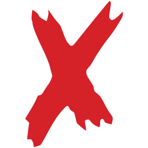

<p align="center">
    <a href="https://github.com/MKAbuMattar/devicons-react/releases">
        
    </a>
    <a href="/LICENSE">
        
    </a>
    <a href="https://github.com/MKAbuMattar/devicons-react/stargazers">
        
    </a>
</p>
<br/>

<div align="center">
    <a href="https://github.com/MKAbuMattar/devicons-react">
        
    </a>
    <p align="center">
        devicons-react aims to gather all logos representing development languages and tools, build into <a href="https://github.com/devicons/devicon">devicon</a>
    </p>
    <p align="center">
        <a target="__blank" href="https://devicons-react.netlify.app/">Demo</a>
    </p>
</div>

<h2>Install package</h2>

```bash
#npm
npm install --save devicons-react

#yarn
yarn add devicons-react
```

<h3 id="default">Icon Behavior / props</h3>
<p>Default behavior for icon</p>

```js
import { Fragment } from 'react'
import { Aarch64Plain } from 'devicons-react'

const App = () => {
  return (
    <Fragment>
      <Aarch64Plain />
    </Fragment>
  )
}

export default App
```

<p>Change size and color for icon</p>

```js
import { Fragment } from 'react'
import { Aarch64Plain, ReactOriginal } from 'devicons-react'
import AndroidOriginal from 'devicons-react/icons/AndroidOriginal'

const App = () => {
  return (
    <Fragment>
      <Aarch64Plain />
      <ReactOriginal fill="red" height="500" width="500" />
      <AndroidOriginal fill="#d35" height="128" width="128" />
    </Fragment>
  )
}

export default App
```
